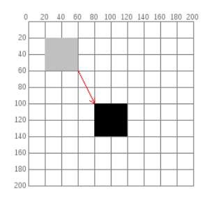
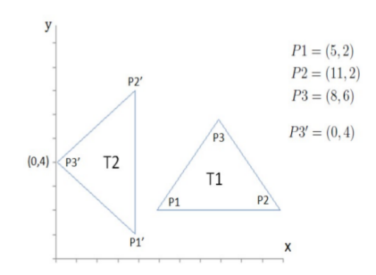

@import "https://cdn.plot.ly/plotly-latest.min.js"

# Computação Gráfica

## Lista de Exercícios 1 - Teoria

**Fernando Gonçalves Campos - 12542352**

**OBS: se o exercício não informar, então assumir transformação geométrica 2D.**

**Configuração da Listade Exercícios:**\
**Variável $\mathbf{D = 7}$**\
**Variável $\mathbf{M = 3}$**


**1) O que são e por qual motivo utilizar coordenadas homogêneas para especificar transformações geométricas em CG?**

São representações de coordenadas que possuem uma "dimensão" a mais do que o necessário, essa "dimensão" extra facilita a manipulação das coordenadas.

Coordenadas homogêneas são utilizadas por facilitar manipular a posição dos objetos, já que possibilitam utilizar multiplicação de matrizes para representar transformações afins, além das transformações lineares.


**2) Apresente a matriz que representa uma transformação geométrica consistindo de uma translação seguidade uma rotação.**

$$
    \left[\begin{array}{ccc}
        cos\,\theta  & -sen\,\theta & 0\\
        sen\,\theta  &  cos\,\theta & 0\\
        0          &  0         & 1
    \end{array}\right]
    \left[\begin{array}{ccc}
        1 & 0 &  t_{x}\\
        0 & 1 &  t_{y}\\
        0 & 0 &  1
    \end{array}\right]
    =
    \left[\begin{array}{ccc}
        cos\,\theta  &  -sen\,\theta &  t_{x}\cdot cos\,\theta\ - t_{y} \cdot sen\,\theta  \\
        sen\,\theta  &  cos\,\theta  &  t_{x} \cdot sen\,\theta + t_{y} \cdot cos\,\theta\\
        0   &  0 &  1
    \end{array}\right]
$$


**3) Apresente a matriz que representa uma transformação consistindo de uma translação $\mathbf{t_{x} = M}$ e $\mathbf{t_{y} = D}$ seguida de uma escala uniforme $\mathbf{s = 2}$.**

$$
    \left[\begin{array}{ccc}
        s  &  0 & 0\\
        0  &  s & 0\\
        0  &  0 & 1
    \end{array}\right]
    \left[\begin{array}{ccc}
        1 & 0 &  t_{x}\\
        0 & 1 &  t_{y}\\
        0 & 0 &  1
    \end{array}\right]
    =
    \left[\begin{array}{ccc}
        s & 0 & s \cdot t_{x}\\
        0 & s & s \cdot t_{y}\\
        0 & 0 & 1
    \end{array}\right]
$$

$$
    \left[\begin{array}{ccc}
        2 & 0 & 6 \\
        0 & 2 & 14\\
        0 & 0 & 1
    \end{array}\right]
$$


**4) Verifique se $\mathbf{R(M+D)}$ irá obter a mesma matriz de transformação do que $\mathbf{R(M)*R(D)}$.**

$R(M+D):$
$$
    R(M+D)=
    \left[\begin{array}{ccc}
        cos\,(M+D)  & -sen\,(M+D) & 0\\
        sen\,(M+D)  &  cos\,(M+D) & 0\\
        0           &  0          & 1
    \end{array}\right]
$$

$R(M) * R(D):$
$$
    R(M)=
    \left[\begin{array}{ccc}
        cos\,(M)  & -sen\,(M) & 0\\
        sen\,(M)  &  cos\,(M) & 0\\
        0         &  0        & 1
    \end{array}\right],\
    R(D)=
    \left[\begin{array}{ccc}
        cos\,(D)  & -sen\,(D) & 0\\
        sen\,(D)  &  cos\,(D) & 0\\
        0         &  0        & 1
    \end{array}\right]
$$

$$
    R(M) * R(D)=
    \left[\begin{array}{ccc}
        cos\,(M)\cdot cos\,(D) - sen\,(M)\cdot sen\,(D) & -cos\,(M)\cdot sen\,(D) - sen\,(M)\cdot cos\,(D) & 0\\
        cos\,(M)\cdot sen\,(D) + sen\,(M)\cdot cos\,(D) &  cos\,(M)\cdot cos\,(D) - sen\,(M)\cdot sen\,(D) & 0\\
        0         &  0        & 1
    \end{array}\right]
$$

Como:
$$
sen\,(\alpha + \beta) = sen\,(\alpha)\cdot cos\,(\beta) + sen\,(\beta) \cdot cos\,(\alpha)\\
cos\,(\alpha + \beta) = cos\,(\alpha)\cdot cos\,(\beta) - sen\,(\alpha)\cdot cos\,(\beta)
$$

Então:
$$
    R(M) * R(D)=
    \left[\begin{array}{ccc}
        cos\,(M+D)  & -sen\,(M+D) & 0\\
        sen\,(M+D)  &  cos\,(M+D) & 0\\
        0           &  0          & 1
    \end{array}\right]
    =R(M+D)
$$

Resposta: Assumindo um cenário ideal (em que não há arredondamentos em nenhuma das etapas), as matrizes de transformação são iguais.


**5) Forneça a matriz de transformação que realiza a transformação abaixo (a seta indica o objeto inicial e o final após a transformação). Em seguida, apresente as coordenadas do objeto para uma escala uniforme $\mathbf{s = M}$.**

{style="display:block;margin: 0 auto"}

$$
    \left[\begin{array}{ccc}
        1 & 0 &  60\\
        0 & 1 &  80\\
        0 & 0 &  1
    \end{array}\right]
$$

Coordenadas depois da escala (sentido horário começando do superior esquerdo):
$P1 = (240, 300)$
$P2 = (360, 300)$
$P3 = (360, 420)$
$P4 = (240, 420)$


**6) Abaixo é apresentada a matriz resultante de quatro transformações.**\
**Aplique esta transformação em triângulo $\mathbf{ABC}$ $\mathbf{(A=(0,0), B=(1,0), C=(0,1))}$ e mostre o resultado (novos vértices e o desenho). Em seguida, faça uma translação $\mathbf{tx = M/10}$ e $\mathbf{ty = M/10}$.**

$$
    \underbrace{
        \left[\begin{array}{ccc}
            1 & 0 &  3\\
            0 & 1 & -2\\
            0 & 0 &  1
        \end{array}\right]}
    _{_{\text{Translation by (3,-2)}}}
    \underbrace{
        \left[\begin{array}{ccc}
            0.6  & -0.8 & 0\\
            0.8  &  0.6 & 0\\
            0    &  0   & 1
        \end{array}\right]}
    _{_{\text{Rotation through 53.13°}}}
    \underbrace{
        \left[\begin{array}{ccc}
            2 & 0 & 0\\
            0 & 2 & 0\\
            0 & 0 & 1
        \end{array}\right]}
    _{_{\text{Scaling by 2}}}
    \underbrace{
        \left[\begin{array}{ccc}
            1 & 0.5 & 0\\
            0 & 1   & 0\\
            0 & 0   & 1
        \end{array}\right]}
    _{_{\text{Shearing by 0.5}}}
    =
    \left[\begin{array}{ccc}
        1.2 & -1 &  3\\
        1.6 &  2 & -2\\
        0   &  0 &  1
    \end{array}\right]
$$

Vértice $A$
$$
    \left[\begin{array}{ccc}
        1.2 & -1 &  3\\
        1.6 &  2 & -2\\
        0   &  0 &  1
    \end{array}\right]
    \left[\begin{array}{c}
        0\\
        0\\
        1
    \end{array}\right]
    =
    \left[\begin{array}{c}
        3\\
        -2\\
        1
    \end{array}\right]
$$

$A = (3, -2)$

Vértice $B$
$$
    \left[\begin{array}{ccc}
        1.2 & -1 &  3\\
        1.6 &  2 & -2\\
        0   &  0 &  1
    \end{array}\right]
    \left[\begin{array}{c}
        1\\
        0\\
        1
    \end{array}\right]
    =
    \left[\begin{array}{c}
        4.2\\
        -0.4\\
        1
    \end{array}\right]
$$

$B = (4.2, -0.4)$

Vértice $C$
$$
    \left[\begin{array}{ccc}
        1.2 & -1 &  3\\
        1.6 &  2 & -2\\
        0   &  0 &  1
    \end{array}\right]
    \left[\begin{array}{c}
        0\\
        1\\
        1
    \end{array}\right]
    =
    \left[\begin{array}{c}
        2\\
        0\\
        1
    \end{array}\right]
$$

$C = (2, 0)$

```javascript {cmd=true hide=true element="<div id='triangles' style="display:block;margin: 0 auto"></div>"}
var PLOT = document.getElementById('triangles')
var data = {
    x: [-0.8,3.0,3.3],
    y: [1.4,-0.6,2.5],
    text: ['triângulo original', '2º triângulo', 'triângulo final'],
    mode: 'text'
};

var layout = {
    xaxis: {
        range: [-5, 5]
    },
    yaxis: {
        range: [-5, 5]
    },
    width: 500,
    height: 500,
    shapes: [
        {
            type: 'path',
            path: 'M 0 0 L 1 0 L 0 1 Z',
            fillcolor: 'rgba(255, 0, 0, 0.5)',
            line: {
                color: 'rgb(255, 0, 0)'
            }
        },
        {
            type: 'path',
            path: 'M 3 2 L 4.2 -0.4 L 2 0 Z',
            fillcolor: 'rgba(0, 0, 255, 0.5)',
            line: {
                color: 'rgb(0, 0, 255)'
            }
        },
        {
            type: 'path',
            path: 'M 3.3 2.3 L 4.5 -0.1 L 2.3 0.3 Z',
            fillcolor: 'rgba(0, 255, 0, 0.5)',
            line: {
                color: 'rgb(0, 255, 0)'
            }
        }
  ]
};

// Display using Plotly
Plotly.newPlot(PLOT, [data], layout);
```


Nova transformação

$$
    \left[\begin{array}{ccc}
        1 & 0 & 0.3\\
        0 & 1 & 0.3\\
        0 & 0 & 1
    \end{array}\right]
$$


**7) Mostre que a ordem das transformações pode modificar a matriz de transformação resultante (problema da comutatividade).**\
**OBS: É suficiente fornecer um exemplo.**

Exemplo: $T * S \neq S * T$

$$
    T =
    \left[\begin{array}{ccc}
        1 & 0 &  t_{x}\\
        0 & 1 &  t_{y}\\
        0 & 0 &  1
    \end{array}\right],\
    S =
    \left[\begin{array}{ccc}
        s  &  0 & 0\\
        0  &  s & 0\\
        0  &  0 & 1
    \end{array}\right]
$$

$$
    T * S =
    \left[\begin{array}{ccc}
        s & 0 & t_{x}\\
        0 & s & t_{y}\\
        0 & 0 & 1
    \end{array}\right]
$$

$$
    S * T =
    \left[\begin{array}{ccc}
        s & 0 & s \cdot t_{x}\\
        0 & s & s \cdot t_{y}\\
        0 & 0 & 1
    \end{array}\right]
$$

$$
    \left[\begin{array}{ccc}
        s & 0 & t_{x}\\
        0 & s & t_{y}\\
        0 & 0 & 1
    \end{array}\right]
    \neq
    \left[\begin{array}{ccc}
        s & 0 & s \cdot t_{x}\\
        0 & s & s \cdot t_{y}\\
        0 & 0 & 1
    \end{array}\right]
$$

---

**8) As transformações de rotação e escala são comutativas entre si?**\
**OBS: a ordem da multiplicação dessas transformações altera a matriz de transformação resultante?**

Não

**9) As transformações de translação e escala são comutativas entre si? E entre translação e rotação?**

Não e não


**10) Forneça a sequência de transformações que leva o triângulo $\mathbf{T1}$ ao triângulo $\mathbf{T2}$ e dê a matriz resultante.**

{style="display:block;margin: 0 auto"}

1ª transformação = Translação $(-8, -6)$, move o ponto $P3$ para a origem;

2ª transformação = Rotação de 90° no sentido anti-horário, faz com que $T1$ "aponte" na mesma direção que $T2$;

3ª transformação = Translação $(0, 4)$, posiciona os dois triângulos na mesma posição.

Matriz resultante:
$$
    \left[\begin{array}{ccc}
        cos\,(90°) & -sen\,(90°) &   - 8\,cos\,(90°) + 6\,sen\,(90°)\\
        sen\,(90°) &  cos\,(90°) & 4 - 6\,cos\,(90°) -8\,sen\,(90°)\\
        0 & 0 & 1
    \end{array}\right]
$$

$$
    \left[\begin{array}{ccc}
        0 & -1 &  6\\
        1 &  0 & -4\\
        0 &  0 &  1
    \end{array}\right]
$$


**11) Seja um quadrado de lado $\mathbf{L = 5}$, inicialmente posicionado em $\mathbf{x = M}$ e $\mathbf{y = D}$. Calcule e apresente a matriz de transformação que faça o quadrado rotacionar $\mathbf{45°}$ em relação ao seu próprio centro.**\
**Apresente os vértices iniciais e finais do quadrado.**

$$
    \left[\begin{array}{ccc}
        cos\,(45°) & -sen\,(45°) & M - M\,cos\,(45°) + D\,sen\,(45°)\\
        sen\,(45°) &  cos\,(45°) & D - D\,cos\,(45°) -M\,sen\,(45°)\\
        0 & 0 & 1
    \end{array}\right]
$$
$$
    \left[\begin{array}{ccc}
        \frac{\sqrt{2}}{2} & -\frac{\sqrt{2}}{2} & 3+ 2\sqrt{2}\\
        \frac{\sqrt{2}}{2} &  \frac{\sqrt{2}}{2} & 7 - 5\sqrt{2}\\
        0 & 0 & 1
    \end{array}\right]
$$

Iniciais:
$P1 = (0.5, 4.5)$
$P2 = (5.5, 4.5)$
$P3 = (5.5, 9.5)$
$P4 = (0.5, 9.5)$

Finais:
$P1 = (3, 7-\frac{5\sqrt{2}}{2})$
$P2 = (3+\frac{5\sqrt{2}}{2}, 7)$
$P3 = (3, 7+\frac{5\sqrt{2}}{2})$
$P4 = (3-\frac{5\sqrt{2}}{2}, 7)$


**12) Dado um vértice/ponto posicionado em $\mathbf{x = D}$ e $\mathbf{y = M}$, apresente as matrizes de transformação para *(1)* espelhar esse vértice em relação ao *eixo X* e *(2)* espelhar esse vértice em relação ao *eixo Y*.**


$$
    \text{espelhar no eixo X} =
    \left[\begin{array}{ccc}
        1 &  0 &  0\\
        0 & -1 &  0\\
        0 &  0 &  1
    \end{array}\right] \tag{1}
$$
$$
    \text{espelhar no eixo Y} =
    \left[\begin{array}{ccc}
        -1 & 0 & 0\\
         0 & 1 & 0\\
         0 & 0 & 1
    \end{array}\right] \tag{2}
$$


**13) Pesquisa e descreva sobre as matrizes de transformação 3D para fazer espelhamento de um objeto.**

Para espelhar um objeto em relação a um plano $ax + by + cz + d = 0$ a matriz de transformação será:
$$
    \left[\begin{array}{cccc}
        1 - 2a^{2} & -2ab       & -2ac       & -2ad\\
        -2ab       & 1 - 2b^{2} & -2bc       & -2bd\\
        -2ab       & -2bc       & 1 - 2c^{2} & -2cd\\
        0          & 0          & 0          & 1
    \end{array}\right]
$$


**14) Explique, com suas palavras, o mapeamento 2D de uma imagem de textura para um objeto 3D (apresente pelo menos 3 tipos de mapeamento).**

O mapeamento é a escolha de quais partes da texturam correspondem a cada face do objeto 3D,

Tipos de mapeamento:

1) Mapeamento planar: Todos os pontos de uma mesma normal do plano escolhido possuem a mesma coordenada de textura.

2) Mapeamento cúbico: O objeto é envolto por um cubo (textura) e a textura é mapeada a partir das normais de cada face do cubo.

3) Mapeamento esférico: O objeto é envolto em uma esfera (textura) e a textura é mapeada com base nas intersecções dos raios da esfera com o objeto.

**15) Em texturas, explique a relação entre Pixels e Texels.**

Pixel: menor elemento de uma tela.

Texel: menor elemento de uma imagem.

Cada pixel representa a cor de um ou mais texels.


**16) Na parametrização de texturas, explique a diferença entre os parâmetros *REPEAT* e *CLAMP*.**

*REPEAT*: Quando uma se tenta utilizar o valor um texel que está fora da textura, o texel será escolhido "dando a volta na textura", isso fará com que a textura seja aplicada repetidas vezes.

*CLAMP*: Quando uma se tenta utilizar o valor um texel que está fora da textura, o texel escolhido será o mesmo da borda da textura, isso fará com que a textura seja aplicada de forma que as bordas fiquem esticadas.


**17) Durante o mapeamento de pixels e texels, qual a diferença entre as técnicas *LINEAR* e *NEAREST*?**

*LINEAR*: escolhe o valor com base na interpolação dos texels vizinhos da coordenada da textura.

*NEAREST*: escolhe o valor com base no texel mais próximo da coordenada da textura.