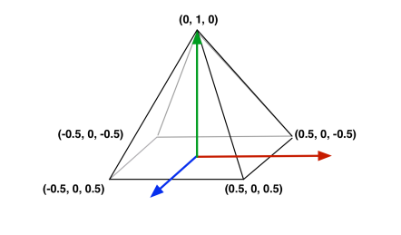
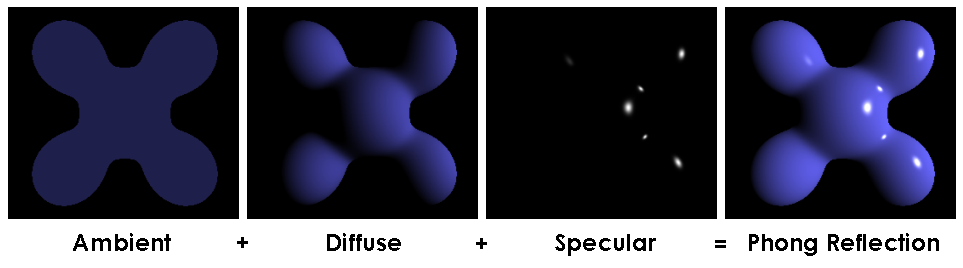
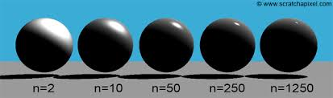
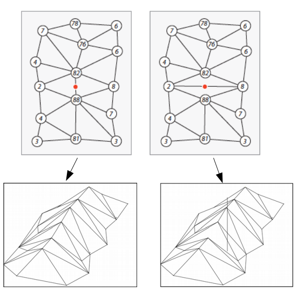
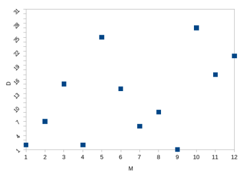

# Computação Gráfica

## Lista de Exercícios 2
**Fernando Gonçalves Campos - 12542352**

**Configuração da Listade Exercícios:**\
**Variável $\mathbf{D = 7}$**\
**Variável $\mathbf{M = 3}$**
___

### Parte 1 - Viewing 3D (Model, View, Projection)

**1) As matrizes Model, View e Projection utilizam transformações geométricas 3D para compor as coordenadas de mundo, visão e clip. Esse processo também é chamado de pipeline do Viewing 3D. Escreva, com suas palavras, a função de cada etapa do pipeline.**

Model: Manipula a posição de modelos individualmente no espaço.

View: Manipula a posição de todos os modelos simultaneamente, essa manipulação cria a impressão de movimento da câmera.

Projection: Determina como que os pontos do espaço devem ser mapeados (projetados) nos pixels da tela.

___

**Para a resolução dos exercícios 2, 3, 4 e 5 considere a seguinte pirâmide, em seu espaço de coordenadas local.**

{style="display:block;margin: 0 auto"}

___

**2) Apresente a matriz Model para transladar a pirâmide $\mathbf{-M}$ no eixo z, ou seja, para posicionar a pirâmide mais ao “fundo” no espaço de mundo. Apresente as coordenadas da pirâmide no espaço de mundo.**

$$
    \left[\begin{array}{cccc}
        1 & 0 & 0 &  0\\
        0 & 1 & 0 &  0\\
        0 & 0 & 1 & -3\\
        0 & 0 & 0 &  1
    \end{array}\right]
$$

Coordenadas:
$P1 = (0, 1, -3)$
$P2 = (-0.5, 0, -2.5)$
$P3 = (-0.5, 0, -3.5)$
$P4 = (0.5, 0, -3.5)$
$P5 = (0.5, 0, -2.5)$

___

**3) Apresente uma matriz View, com parâmetros definidos por você, e as coordenadas da pirâmide no espaço de Visão.**

Posição da câmera:
$$P_{0} = (0, 0, 0)$$

Para onde a câmera está olhando:
$$look\_at = (0, 0, -1)$$

Normal da câmera:
$$N = P_{0} - look\_at = (0, 0, 1)$$

Direção para cima da câmera:
$$V = (0, 1, 0)$$

Eixo z da câmera:
$$n = \frac{N}{|N|} = (0, 0, 1)$$

Eixo x da câmera:

$$u = \frac{V \times n}{|V\times n|} = (1, 0, 0)$$

Eixo y da câmera:
$$v = n \times u = (0, 1, 0)$$

Matriz view:
$$
    \left[\begin{array}{cccc}
        u_{x} & u_{y} & u_{z} &  -u\cdot P_{0}\\
        v_{x} & v_{y} & v_{z} &  -v\cdot P_{0}\\
        n_{x} & n_{y} & n_{z} &  -n\cdot P_{0}\\
        0 & 0 & 0 &  1
    \end{array}\right]
    =
    \left[\begin{array}{cccc}
        1 & 0 & 0 &  0\\
        0 & 1 & 0 &  0\\
        0 & 0 & 1 &  0\\
        0 & 0 & 0 &  1
    \end{array}\right]
$$

Coordenadas:
$P1 = (0, 1, -3)$
$P2 = (-0.5, 0, -2.5)$
$P3 = (-0.5, 0, -3.5)$
$P4 = (0.5, 0, -3.5)$
$P5 = (0.5, 0, -2.5)$
___

**4) Apresente uma matriz de Projeção Perspective (Projection), com parâmetros definidos por você, e as coordenadas da pirâmide no espaço de Clip.**

$$\text{Largura} = 1$$

$$\text{Altura} = 1$$

$$\text{proporção} = \frac{\text{largura}}{\text{altura}}$$

$$\theta = 90°$$

$$z \in [1, 2]$$

Matriz de Projeção Perspective
$$
    \left[\begin{array}{cccc}
        \frac{\cot(\frac{\theta}{2})}{\text{proporção}} & 0 & 0 &  0\\
        0 & \cot(\frac{\theta}{2}) & 0 &  0\\
        0 & 0 & \frac{z_{near} + z_{far}}{z_{near} - z_{far}} & -\frac{2 \cdot z_{near} \cdot z_{far}}{z_{near} - z_{far}}\\
        0 & 0 & -1 & 0
    \end{array}\right]
    =
    \left[\begin{array}{cccc}
        1 & 0 &  0 &  0\\
        0 & 1 &  0 &  0\\
        0 & 0 & -3 & 4\\
        0 & 0 & -1 & 0
    \end{array}\right]
$$

Coordenadas:
$P1 = (0, \frac{1}{3}, \frac{13}{3})$
$P2 = (-\frac{1}{5}, 0, \frac{23}{5})$
$P3 = (-\frac{1}{7}, 0, \frac{29}{7})$
$P4 = (\frac{1}{7}, 0, \frac{29}{7})$
$P5 = (\frac{1}{5}, 0, \frac{23}{5})$

___

**5) Apresente uma matriz de Projeção Ortogonal (Projection), com parâmetros definidos por você, e as coordenadas da pirâmide no espaço de Clip.**

$$x \in [-1, 1]$$

$$y \in [-1, 1]$$

$$z \in [-1, 1]$$

Matrix de Projeção Ortogonal
$$
    \left[\begin{array}{cccc}
        \frac{2}{x_{max} - x_{min}} & 0 & 0 & -\frac{x_{max} + x_{min}}{x_{max} - x_{min}}\\
        0 & \frac{2}{y_{max} - y_{min}} & 0 & -\frac{y_{max} + y_{min}}{y_{max} - y_{min}}\\
        0 & 0 & \frac{2}{z_{far} - z_{near}} & -\frac{z_{far} + z_{near}}{z_{far} - z_{near}}\\
        0 & 0 & 0 &  1
    \end{array}\right]
    =
    \left[\begin{array}{cccc}
        1 & 0 & 0 &  0\\
        0 & 1 & 0 &  0\\
        0 & 0 & 1 &  0\\
        0 & 0 & 0 &  1
    \end{array}\right]
$$

Coordenadas:
$P1 = (0, 1, -3)$
$P2 = (-0.5, 0, -2.5)$
$P3 = (-0.5, 0, -3.5)$
$P4 = (0.5, 0, -3.5)$
$P5 = (0.5, 0, -2.5)$

___

**6) Qual o objetivo dos parâmetros** ***Near*** **e** ***Far*** **na matriz de projeção?**

Determinar qual as distâncias mínima e máxima que um objeto deve estar da câmera para que seja visível.

___

**7) Qual a relação do Frustum com o que será exibido na cena 3D?**

Ele representa a porção do mundo que é visível.

___

**8) Explique, com suas palavras, o mapeamento 2D de uma imagem de textura para um objeto 3D (apresente pelo menos 3 tipos de mapeamento).**

O mapeamento é a escolha de quais partes da texturam correspondem a cada face do objeto 3D,

Tipos de mapeamento:

1) Mapeamento planar: Todos os pontos de uma mesma normal do plano escolhido possuem a mesma coordenada de textura.

2) Mapeamento cúbico: O objeto é envolto por um cubo (textura) e a textura é mapeada a partir das normais de cada face do cubo.

3) Mapeamento esférico: O objeto é envolto em uma esfera (textura) e a textura é mapeada com base nas intersecções dos raios da esfera com o objeto.

___

### Parte 2 - Modelos de iluminação

**1) Discuta sobre as diferenças entre iluminação ambiente, reflexão difusa e reflexão especular. Apresente um exemplo (figuras diferentes dos slides) do efeito dessas iluminações em algum modelo (pode pesquisar em sites especializados ou construir/programar o seu próprio exemplo).**

- Iluminação Ambiente: luz que afeta todo o objeto de forma uniforme, não depende das posições da câmera, do objeto ou das fontes de luz.

- Reflexão difusa: luz parte da fonte de luz e é parcialmente absorvida pelo objeto, não depende da posição da câmera, mas depende das posições do objeto e das fontes de luz.

- Reflexão especular: Luz que parte de uma fonte e ao encontrar com um objeto é refletida principalmente em direção à câmera, depende das posições da câmera, do objeto e das fontes de luz.

{style="display:block;margin: 0 auto"}

___

**2) Pesquise e descreva sobre superfícies que são refletores difusos ideais e superfícies que são refletores especulares ideais e sua conexão com as equações dos modelos de iluminação estudados na disciplina.**

- Superfícies refletores difusos ideais: superfícies que são completas de imperfeições a nível microscópico, as imperfeições devem ser maiores que o comprimento da luz, isso faz com que os raios de luz reflitam em várias direções. Isso é simulado pelo modelo de iluminação com reflexão difusa.

- Superfícies refletores especulares ideais: superfícies que não possuem imperfeições, a luz reflete com base no ângulo de incidência da luz em relação à normal do objeto. Isso é simulado pelo modelo de iluminação com reflexão especular.

___

**3) Na equação de iluminação ambiente + reflexão difusa abaixo, descreva o significado dos parâmetros $k_{a}$ e $k_{d}$ e explique o que acontece com a reflexão difusa conforme variação de $N\cdot L$.**

$$
    I_{diff} =
    \begin{cases}
        k_{a} I_{a} + k_{d} I_{l} (N\cdot L), & \text{se } N\cdot L \gt 0\\
        k_{a} I_{a}, & \text{se } N\cdot L \le 0
    \end{cases}
$$

- $k_{a}$: coeficiente de reflexão ambiente, representa quanto um objeto é afetado pela luz ambiente.

- $k_{d}$: coeficiente de reflexão difusa, quanto da luz incidente é refletida.

Quanto maior o valor de $N\cdot L$, maior será o efeito de reflexão difusa.
___

**4) Considere uma superfície plana de cor uniforme RGB $(\mathbf{0.5, 0.7, 0.2})$ e os coeficientes $k_{a} = 1/D$ e $k_{d} = 1/M$. Apresente três diferentes cenários de iluminação com base na equação de iluminação ambiente + reflexão difusa (Exercício 3). No primeiro cenário, a direção da fonte de luz é perpendicular à superfície. No segundo cenário, a direção está posicionada $90°$ (em relação a $N$) da superfície. No terceiro cenário, a direção está posicionada a $45°$. Use $I_{a} = 1$ e $I_{l} = 1$.**

$k_{a} = 1/7$
$k_{d} = 1/3$

* 1º Cenário:
    $$N \cdot L = \cos(0°) = 1$$

    $$I_{diff} = 1/7 + 1/3 = 10/21$$

    Cor final RGB: $(\frac{5}{21}, \frac{1}{3}, \frac{2}{21})$
     

* 2º Cenário:
    $$N \cdot L = \cos(90°) = 0$$

    $$I_{diff} = 1/7$$

    Cor final RGB: $(\frac{1}{14}, \frac{1}{10}, \frac{1}{35})$
     

* 3º Cenário:
    $$N \cdot L = \cos(45°) = \sqrt{2}/2$$

    $$I_{diff} = 1/7 + \sqrt{2}/6$$

    Cor final RGB: $(\frac{1}{14} + \frac{7\sqrt{2}}{12}, \frac{1}{10} + \frac{7\sqrt{2}}{60}, \frac{1}{35} + \frac{\sqrt{2}}{30})$

___

**5) Na equação de iluminação de Phong, qual é o componente que permite manipular a reflexão especular? Como esse componente pode ser manipulado?**

O expoente de reflexão especular $n_{s}$, ele determina quâo concentrada é a reflexão.
___

**6) Apresente o modelo de iluminação de Phong e descreva o significado de cada um dos parâmetros da equação, incluindo o efeito (pode ser descrição textual / imagens para exemplificar são opcionais) na aparência final de um modelo.**

$$
    I_{spec}
    \begin{cases}
        k_{s} I_{l} (V\cdot R)^{n_{s}}, & \text{se } V\cdot R \gt 0\\
        0.0, & \text{se } V\cdot R \le 0
    \end{cases}
$$

- Coeficiente de reflexão especular $k_{s}$: quanto um modelo é afetado por iluminação especular.

- Expoente de reflexão especular $n_{s}$: quão reflexivo a superfície é, ou seja, quão concentrado é a reflexão.

- Direção do raio de luz após a reflexão R.

- Direção do raio de luz refletido em direção à câmera.

{style="display:block;margin: 0 auto"}
___

**7) Descreva com suas palavras as etapas para computar os vetores $N$, $L$ e $H$.**

- $N$ é o vetor da normal do objeto, ele já é "entregue" pelo objeto.

- $L$ é o vetor da fonte de luz, ele é calculado com base nas posições do objeto e da fonte de luz.

- $H$ é o vetor que fica entre o raio de luz incidente e o raio de luz que chega na câmera. Ele representa qual seria a normal da superfície para que o raio de luz seja refletido dessa maneira.
___

**8) Dado o modelo de Phong (eq. do Exercício 6), compare e discorra sobre o que pode acontecer com a aparência final de um objeto quando (a) $ns = 2M$ e (b) $ns = 2D$.**

a) $n_{s} = 6$: A área de reflexão especular será maior.
b) $n_{s} = 14$: A área de reflexão especular será menor.

___

**9) Como o modelo de Phong pode ser alterado para considerar múltiplas fontes de luz? Em seguida, apresente uma equação para calcular o modelo de Phong para duas fontes de luz.**

As fontes de luz podem ser somadas para conseguir o valor resultante.

$$
I = I_{a} + \sum^{2}_{l=1}{I_{l,diff} + I_{l,spec}}
$$

___

**10) Em relação à triangulação, mostre quais as vantagens na triangulação de Delaunay. Como isso pode impactar na superfície de terrenos? Dê um exemplo de como diferentes triangulações podem inclusive afetar a iluminação da superfície.**

Reduz a quantidade de triângulos com ângulos obtusos.

Pode criar/escoder vales em um terreno
{style="display:block;margin: 0 auto"}

Isso pode afetar a iluminação, já que as normais calculadas podem não se aplicar para uma das triangulações, o que pode gerar afetar a iluminação de forma errada.
___

**11) Na Figura abaixo são apresentados 12 pontos/vértices. O eixo x indica a variável $M$ e o eixo y indica a variável $D$. Aplique a triangulação de delaunay (algoritmo incremental). No entanto, a escolha do primeiro ponto/vértice deve ser o ponto/vértice mais próximo de seus valores $M$ e $D$ (e não aleatoriamente). Apresente os principais passos da triangulação. Não é necessário apresentar os testes para legalizar as arestas (que podem ser feitas por inspeção visual na maioria dos casos).**

{style="display:block;margin: 0 auto"}