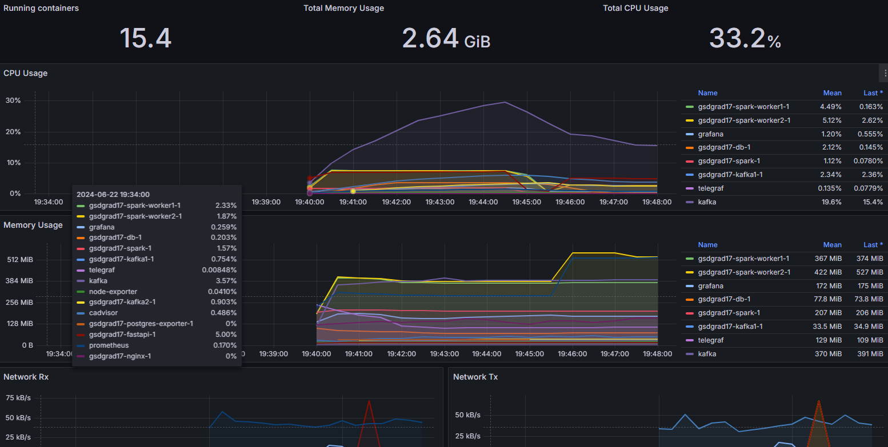
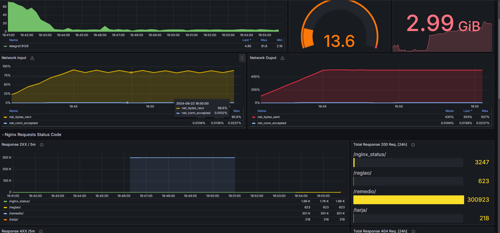
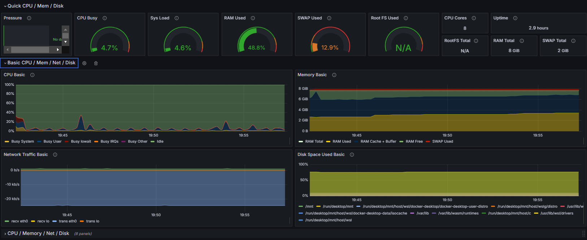
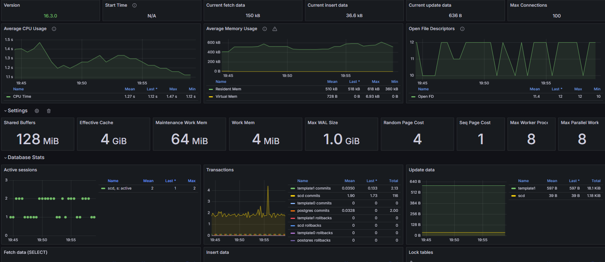

O site irá pedir para logar nele, o usuário é `admin` e a senha é `admin`(Depois de logar o grafana vai pedir para logar com outra conta, essa parte pode ser pulada apertando em `skip`). Entrando no site os dados estarão disponibilizados em dashboards (os dashboards foram configurados para apenas mostrar os dados dos últimos 15 minutos):
- Docker monitoring: dados dos containers do docker recebidos do cAdvisor, indicam quantos recursos cada container está utilizando

- Nginx: dados das "requests" enviadas para o servidor do nginx

- Node exporter: possue muitos dados sobre os recursos do sistema host

- PostgreSQL: dados de utilização do banco de dados

